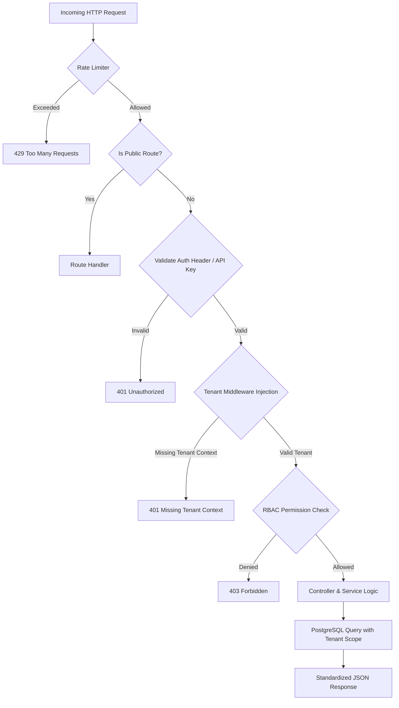

# Request Lifecycle & Security Flow Diagram

```mermaid
flowchart TD
    A[Incoming HTTP Request] --> B{Rate Limiter}
    B -- Exceeded --> C[429 Too Many Requests]
    B -- Allowed --> D{Is Public Route?}
    D -- Yes --> E[Route Handler]
    D -- No --> F{Validate Auth Header / API Key}
    F -- Invalid --> G[401 Unauthorized]
    F -- Valid --> H{Tenant Middleware Injection}
    H -- Missing Tenant Context --> I[401 Missing Tenant Context]
    H -- Valid Tenant --> J{RBAC Permission Check}
    J -- Denied --> K[403 Forbidden]
    J -- Allowed --> L[Controller & Service Logic]
    L --> M[PostgreSQL Query with Tenant Scope]
    M --> N[Standardized JSON Response]
```
