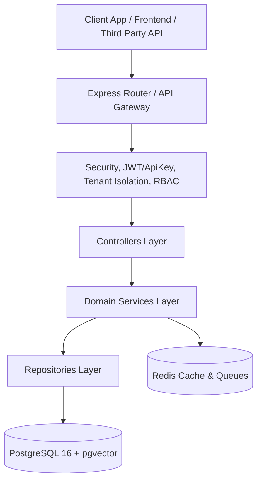

# Ozeonix System Architecture Overview

## Architectural Patterns
Ozeonix AI Employee is designed as a high-throughput, multi-tenant Business Operating System built on Clean Architecture and Hexagonal/Domain-Driven Design (DDD) principles.

## Layers & Responsibilities
1. **Controllers Layer**: Express controllers handling HTTP requests, standardizing Zod request validation, and formatting JSON responses.
2. **Service Layer**: Pure domain logic execution, business rules enforcement, tenant validation, and event handling.
3. **Repository Layer**: Abstraction over Prisma ORM database transactions, entity queries, and soft deletion.
4. **Middleware Layer**: Enforces rate limiting, JWT token rotation, API key validation, multi-tenant context injection (`X-Tenant-ID`), and fine-grained RBAC permission evaluation.
