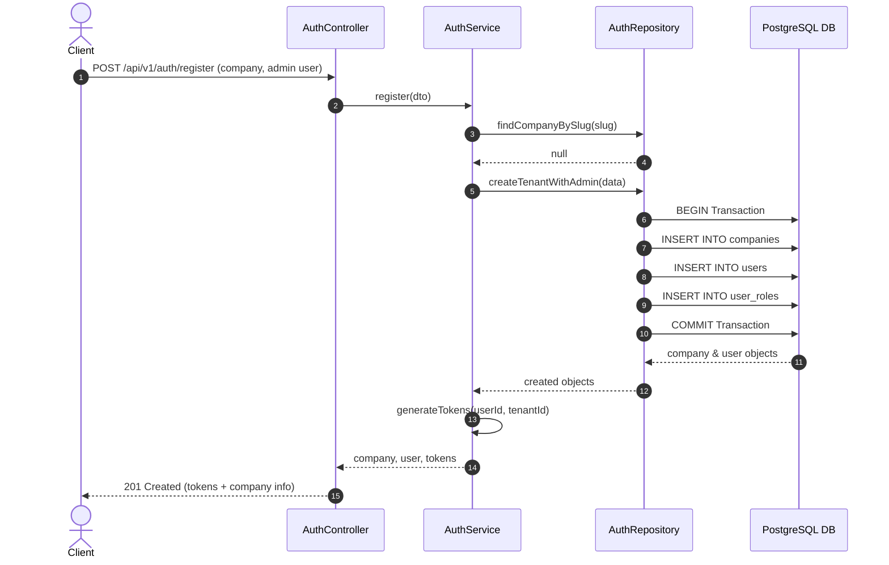

# Sequence Diagrams - Phase 1 Core Flows

## Tenant Registration & Admin Initialization Flow

```mermaid
sequenceDiagram
    autonumber
    actor Client
    participant Controller as AuthController
    participant Service as AuthService
    participant Repo as AuthRepository
    participant DB as PostgreSQL DB

    Client->>Controller: POST /api/v1/auth/register (company, admin user)
    Controller->>Service: register(dto)
    Service->>Repo: findCompanyBySlug(slug)
    Repo-->>Service: null
    Service->>Repo: createTenantWithAdmin(data)
    Repo->>DB: BEGIN Transaction
    Repo->>DB: INSERT INTO companies
    Repo->>DB: INSERT INTO users
    Repo->>DB: INSERT INTO user_roles
    Repo->>DB: COMMIT Transaction
    DB-->>Repo: company & user objects
    Repo-->>Service: created objects
    Service->>Service: generateTokens(userId, tenantId)
    Service-->>Controller: company, user, tokens
    Controller-->>Client: 201 Created (tokens + company info)
```
