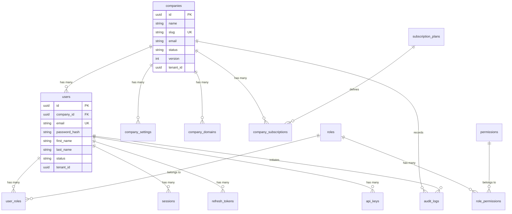

# Entity Relationship Diagram (ERD) - Phase 1 Core Database

```mermaid
erDiagram
    companies ||--o{ users : "has many"
    companies ||--o{ company_settings : "has many"
    companies ||--o{ company_domains : "has many"
    companies ||--o{ company_subscriptions : "has many"
    subscription_plans ||--o{ company_subscriptions : "defines"
    users ||--o{ user_roles : "has many"
    roles ||--o{ user_roles : "belongs to"
    roles ||--o{ role_permissions : "has many"
    permissions ||--o{ role_permissions : "belongs to"
    users ||--o{ sessions : "has many"
    users ||--o{ refresh_tokens : "has many"
    users ||--o{ api_keys : "has many"
    companies ||--o{ audit_logs : "records"
    users ||--o{ audit_logs : "initiates"

    companies {
        uuid id PK
        string name
        string slug UK
        string email
        string status
        int version
        uuid tenant_id
    }

    users {
        uuid id PK
        uuid company_id FK
        string email UK
        string password_hash
        string first_name
        string last_name
        string status
        uuid tenant_id
    }
```
